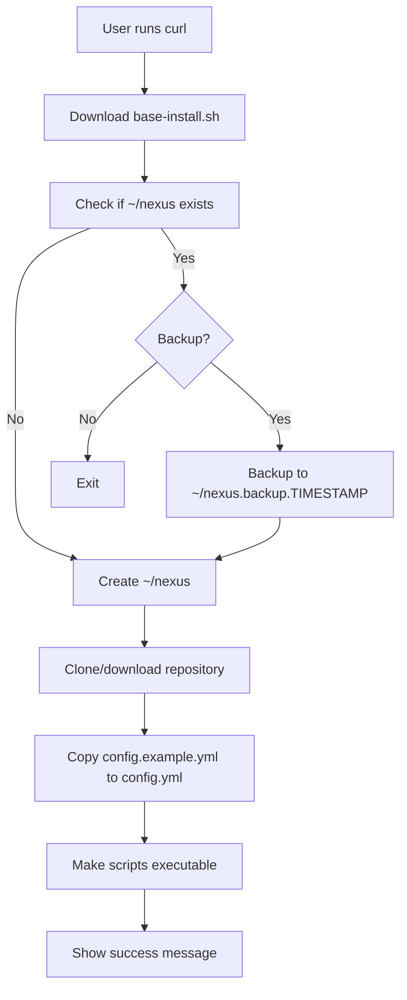
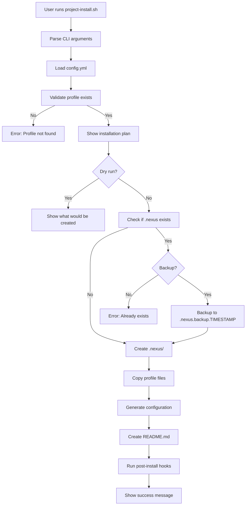

# Project Structure & Architecture
**For: NexusAgent / MindStack**

---

## Complete Repository Structure

```
nexus/                                 # Main repository
├── README.md                         # Project overview
├── LICENSE                           # MIT License
├── CONTRIBUTING.md                   # Contribution guidelines
├── CHANGELOG.md                      # Version history
├── .github/
│   ├── workflows/
│   │   ├── release.yml              # Auto-release on tag
│   │   ├── test.yml                 # Test profiles on PR
│   │   └── docs.yml                 # Deploy docs site
│   └── ISSUE_TEMPLATE/
│       ├── bug_report.md
│       ├── feature_request.md
│       └── profile_request.md
│
├── scripts/                          # Installation & management
│   ├── base-install.sh              # Install to ~/nexus
│   ├── project-install.sh           # Install into project
│   ├── update.sh                    # Update installation
│   ├── create-profile.sh            # Create custom profile
│   ├── validate-profile.sh          # Validate profile structure
│   └── lib/                         # Shared script functions
│       ├── colors.sh                # Terminal colors
│       ├── validation.sh            # Validation functions
│       └── profiles.sh              # Profile management
│
├── profiles/                         # Pre-built profiles
│   ├── default/                     # Basic development workflow
│   │   ├── profile.yml             # Profile metadata
│   │   ├── agents/
│   │   │   ├── workflow-orchestrator.md
│   │   │   ├── task-planner.md
│   │   │   ├── task-executor.md
│   │   │   └── subagents/
│   │   │       ├── code-reviewer.md
│   │   │       ├── test-writer.md
│   │   │       └── doc-writer.md
│   │   ├── commands/
│   │   │   ├── workflow.md
│   │   │   ├── plan-task.md
│   │   │   ├── execute-task.md
│   │   │   ├── review.md
│   │   │   └── test.md
│   │   ├── context/
│   │   │   ├── core/
│   │   │   │   └── essential-patterns.md
│   │   │   ├── architecture/
│   │   │   │   └── project-structure.md
│   │   │   └── workflows/
│   │   │       ├── simple-task.md
│   │   │       └── complex-feature.md
│   │   └── README.md               # Profile documentation
│   │
│   ├── content/                     # Content orchestration
│   │   ├── profile.yml
│   │   ├── agents/
│   │   │   ├── content-orchestrator.md
│   │   │   ├── context-provider.md
│   │   │   ├── research-assistant.md
│   │   │   └── subagents/
│   │   │       ├── twitter-specialist.md
│   │   │       ├── linkedin-specialist.md
│   │   │       ├── blog-specialist.md
│   │   │       ├── youtube-specialist.md
│   │   │       ├── buyer-hook-validator.md
│   │   │       ├── value-compressor.md
│   │   │       ├── contrarian-refiner.md
│   │   │       ├── content-validator.md
│   │   │       └── content-publisher.md
│   │   ├── commands/
│   │   │   ├── create-content-dynamic.md
│   │   │   ├── new-project.md
│   │   │   ├── work-on.md
│   │   │   ├── validate.md
│   │   │   └── publish.md
│   │   ├── context/
│   │   │   ├── brand/
│   │   │   │   ├── voice.md
│   │   │   │   ├── guidelines.md
│   │   │   │   ├── messaging.md
│   │   │   │   └── accuracy-guidelines.md
│   │   │   ├── platforms/
│   │   │   │   ├── twitter/
│   │   │   │   │   ├── specs.md
│   │   │   │   │   └── patterns.md
│   │   │   │   ├── linkedin/
│   │   │   │   ├── blog/
│   │   │   │   └── youtube/
│   │   │   ├── workflows/
│   │   │   │   ├── quick-post.md
│   │   │   │   ├── multi-platform.md
│   │   │   │   ├── research-enhanced.md
│   │   │   │   └── campaign-launch.md
│   │   │   └── review/
│   │   │       ├── checklists.md
│   │   │       └── engagement-signals.md
│   │   └── README.md
│   │
│   ├── governance/                  # Data governance & context management
│   │   ├── profile.yml
│   │   ├── agents/
│   │   │   ├── context-manager.md
│   │   │   └── subagents/
│   │   │       ├── quality-validator.md
│   │   │       ├── lifecycle-manager.md
│   │   │       ├── metadata-updater.md
│   │   │       └── catalog-maintainer.md
│   │   ├── commands/
│   │   │   ├── get-context.md
│   │   │   ├── update-context.md
│   │   │   ├── validate-quality.md
│   │   │   ├── lifecycle-review.md
│   │   │   └── sync-metadata.md
│   │   ├── context/
│   │   │   ├── governance/
│   │   │   │   ├── metadata-schema.md
│   │   │   │   ├── quality-dimensions.md
│   │   │   │   ├── lifecycle-states.md
│   │   │   │   └── sync-strategies.md
│   │   │   └── workflows/
│   │   │       ├── context-retrieval.md
│   │   │       ├── context-update.md
│   │   │       ├── quality-validation.md
│   │   │       └── lifecycle-management.md
│   │   └── README.md
│   │
│   └── custom-example/               # Example custom profile
│       ├── profile.yml
│       ├── agents/
│       ├── commands/
│       ├── context/
│       └── README.md
│
├── templates/                        # Templates for custom creation
│   ├── profile/
│   │   ├── profile.yml.template
│   │   └── README.md.template
│   ├── agent/
│   │   ├── primary-agent.md.template
│   │   └── subagent.md.template
│   ├── command/
│   │   └── command.md.template
│   ├── context/
│   │   └── context-file.md.template
│   └── workflow/
│       └── workflow.md.template
│
├── docs/                             # Documentation site
│   ├── index.md                     # Homepage
│   ├── getting-started/
│   │   ├── installation.md
│   │   ├── quick-start.md
│   │   └── first-workflow.md
│   ├── core-concepts/
│   │   ├── architecture.md
│   │   ├── context-flow.md
│   │   ├── agent-coordination.md
│   │   └── profiles.md
│   ├── profiles/
│   │   ├── default.md
│   │   ├── content.md
│   │   ├── governance.md
│   │   └── custom.md
│   ├── guides/
│   │   ├── creating-custom-profile.md
│   │   ├── writing-agents.md
│   │   ├── writing-commands.md
│   │   ├── context-management.md
│   │   └── workflow-orchestration.md
│   ├── reference/
│   │   ├── cli.md
│   │   ├── configuration.md
│   │   ├── profile-schema.md
│   │   └── api.md
│   ├── examples/
│   │   ├── development-workflow.md
│   │   ├── content-creation.md
│   │   ├── data-governance.md
│   │   └── custom-domain.md
│   └── contributing.md
│
├── examples/                         # Example projects
│   ├── basic-dev-workflow/
│   │   ├── .nexus/                 # Installed profile
│   │   └── README.md
│   ├── content-marketing/
│   │   ├── .nexus/
│   │   └── README.md
│   └── data-governance/
│       ├── .nexus/
│       └── README.md
│
├── tests/                           # Testing
│   ├── profiles/
│   │   ├── test-default.sh
│   │   ├── test-content.sh
│   │   └── test-governance.sh
│   ├── scripts/
│   │   ├── test-install.sh
│   │   └── test-validation.sh
│   └── fixtures/
│       └── sample-projects/
│
├── config.example.yml               # Example configuration
└── package.json                     # Optional: for npm distribution
```

---

## File Structure Standards

### Profile Structure (`profiles/{profile-name}/`)

Every profile must have:

```
profile-name/
├── profile.yml          # REQUIRED: Profile metadata
├── agents/             # REQUIRED: At least one agent
│   └── *.md
├── commands/           # REQUIRED: At least one command
│   └── *.md
├── context/            # REQUIRED: Context files
│   └── *.md
└── README.md           # REQUIRED: Profile documentation
```

### `profile.yml` Schema

```yaml
name: "Profile Name"
version: "1.0.0"
description: "Brief description of what this profile does"
author: "Author Name"
homepage: "https://profile-docs-url.com"

# Profile capabilities
capabilities:
  - content-creation
  - data-governance
  - code-review
  - testing

# AI tool compatibility
compatible_with:
  - opencode
  - cursor
  - claude-desktop

# Dependencies (other profiles this extends)
extends: 
  - default

# Configuration defaults
config:
  context_level: 2
  enable_subagents: true
  enable_workflows: true

# Installation preferences
install:
  folder_name: ".nexus"
  create_examples: true
  required_tools:
    - git
    - node  # optional

# Documentation
documentation:
  quick_start: "README.md"
  examples: "examples/"
  
# Changelog
changelog:
  - version: "1.0.0"
    date: "2025-01-15"
    changes:
      - "Initial release"
```

---

## Installation Flow Architecture

### Base Installation (`~/nexus/`)



### Project Installation (`~/nexus/` → `project/.nexus/`)



---

## Configuration System

### Global Config (`~/nexus/config.yml`)

```yaml
# Nexus Configuration
version: "1.0.0"

# User preferences
user:
  name: "Your Name"
  email: "your@email.com"

# Default installation settings
defaults:
  profile: "default"
  ai_tool: "opencode"
  folder_name: ".nexus"
  context_level: 2
  enable_subagents: true
  backup_existing: true

# Profile-specific overrides
profiles:
  content:
    context_level: 2
    enable_research: true
    auto_validate: true
  governance:
    context_level: 3
    enable_metadata_sync: true
    sync_schedule: "0 2 * * *"
  default:
    context_level: 1

# AI tool integration settings
ai_tools:
  opencode:
    commands_folder: "command"
    agents_folder: "agent/subagents"
    context_folder: "context"
    use_skills: true
    skill_prefix: "@"
  cursor:
    prompts_folder: ".cursor/prompts"
    agents_folder: ".cursor/agents"
    context_folder: ".cursor/context"
    use_skills: false
  claude_desktop:
    config_path: "~/Library/Application Support/Claude/claude_desktop_config.json"
    mcp_servers: true

# Advanced settings
advanced:
  verbose_logging: false
  telemetry: false  # Privacy-first
  auto_update_check: true
  update_channel: "stable"  # stable, beta, nightly

# Installation behavior
install:
  create_examples: true
  create_docs: true
  run_validation: true
  show_tips: true
```

### Project Config (`.nexus/nexus.json`)

```json
{
  "version": "1.0.0",
  "profile": "content",
  "ai_tool": "opencode",
  "installed_at": "2025-01-15T10:30:00Z",
  "nexus_version": "1.0.0",
  "custom_config": {
    "context_level": 2,
    "enable_subagents": true
  },
  "metadata": {
    "project_name": "My Content Project",
    "project_type": "content-marketing",
    "team_size": 1
  }
}
```

---

## CLI Command Structure

### Base Commands

```bash
# Installation
nexus install [options]              # Install into current directory
nexus install --profile content      # Install specific profile
nexus install --dry-run              # Preview installation

# Management
nexus update                          # Update installation
nexus uninstall                       # Remove from project
nexus validate                        # Validate installation

# Profile Management
nexus list-profiles                   # List available profiles
nexus create-profile <name>          # Create custom profile
nexus show-profile <name>            # Show profile details
nexus validate-profile <name>        # Validate profile structure

# Configuration
nexus config                          # Show current config
nexus config set <key> <value>       # Set config value
nexus config get <key>               # Get config value

# Development
nexus dev                            # Development mode
nexus test-profile <name>            # Test profile

# Help
nexus help                           # Show help
nexus version                        # Show version
nexus docs                           # Open documentation
```

### Advanced Commands

```bash
# Profile development
nexus scaffold agent <name>          # Create agent template
nexus scaffold command <name>        # Create command template
nexus scaffold context <name>        # Create context template

# Import/Export
nexus export-profile <name>          # Export profile to .tar.gz
nexus import-profile <path>          # Import profile from file

# Analytics (privacy-respecting)
nexus stats                          # Show usage statistics
nexus report                         # Generate usage report
```

---

## Integration with Different AI Tools

### OpenCode Integration

```bash
# Project structure after installation
.nexus/
├── agent/                    # OpenCode agents folder
│   ├── workflow-orchestrator.md
│   └── subagents/
├── command/                  # OpenCode commands folder
│   ├── workflow.md
│   └── create.md
└── context/                  # Context files
    └── core/

# Usage
/workflow "create a feature"
@workflow-orchestrator "analyze this"
```

### Cursor Integration

```bash
# Project structure after installation
.cursor/
├── prompts/                  # Cursor prompts folder
│   ├── workflow.md
│   └── create.md
└── agents/                   # Custom agents
    └── orchestrator.md

# Usage
@workflow create a feature
```

### Claude Desktop Integration

```bash
# Adds to claude_desktop_config.json
{
  "mcpServers": {
    "nexus": {
      "command": "node",
      "args": ["/path/to/nexus-mcp-server.js"],
      "env": {
        "NEXUS_PROJECT_PATH": "/path/to/project/.nexus"
      }
    }
  }
}
```

---

## Next Steps to Build

1. **Initialize repository** with this structure
2. **Create installation scripts** (base-install.sh, project-install.sh)
3. **Build default profile** first (simplest, most universal)
4. **Build content profile** (your documented use case)
5. **Build governance profile** (your documented use case)
6. **Create documentation site**
7. **Test with real projects**
8. **Launch!**

---

## Repository Name Options

Based on chosen name:

**If NexusAgent:**
- `nextsystems/nexus` ⭐
- `nextsystems/nexusagent`
- `nexus-ai/nexus`

**If MindStack:**
- `mysecondminds/mindstack` ⭐
- `mysecondminds/stack`
- `mindstack/mindstack`

**Recommendation:** Use the shorter version for GitHub (e.g., `nexus` or `mindstack`)
